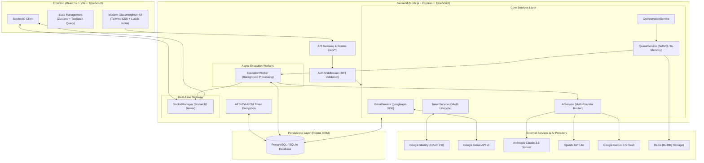
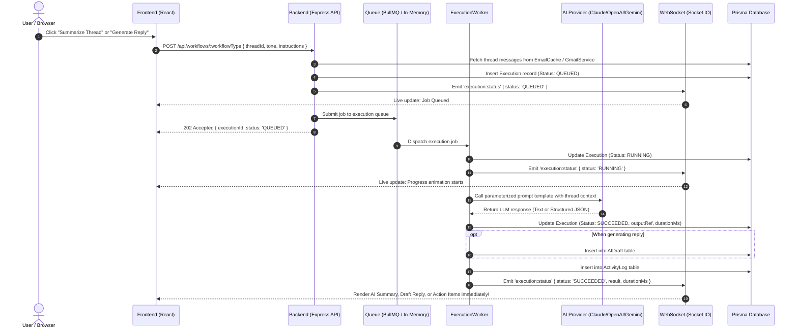
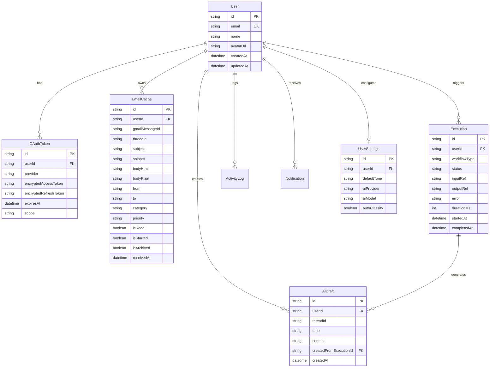

# ⚡ Intelligent Email Assistant

> **A full-stack, AI-powered productivity application that connects to Google Gmail via OAuth 2.0 and layers multi-step agentic AI orchestration, asynchronous job queues, and real-time WebSocket updates over inbox management.**

---

## 📑 Table of Contents

- [Overview](#-overview)
- [Key Features](#-key-features)
- [System Architecture](#-system-architecture)
- [Workflows & Agentic AI Orchestration](#-workflows--agentic-ai-orchestration)
- [Tech Stack](#-tech-stack)
- [Database Schema & Data Models](#-database-schema--data-models)
- [API Reference](#-api-reference)
- [Getting Started & Installation](#-getting-started--installation)
- [Google Cloud OAuth 2.0 Configuration](#-google-cloud-oauth-20-configuration)
- [Zero-Config Sandbox / Demo Mode](#-zero-config-sandbox--demo-mode)
- [Project Directory Structure](#-project-directory-structure)
- [Available Scripts](#-available-scripts)

---

## 🚀 Overview

Processing email inboxes is one of the biggest productivity bottlenecks for modern knowledge workers. **Intelligent Email Assistant** transforms inbox management from a manual reading and typing chore into an AI-augmented copilot experience:

1. **Instant Context**: Open any complex thread to get a bulleted executive summary and plain-language explanation.
2. **One-Click Tone-Aware Replies**: Generate polished draft responses across 4 tone profiles (Professional, Friendly, Formal, Concise) guided by custom user instructions.
3. **Action Item Extraction**: Identify key tasks, assignees, deadlines, and urgency levels with high precision.
4. **Smart Inbox Organization**: Automatic categorization (Work, Primary, Updates, Promotions, Social) and priority scoring (URGENT, HIGH, NORMAL, LOW).
5. **Inspectable AI Execution Engine**: Non-blocking asynchronous execution queue (BullMQ + Redis with in-memory fallback) with real-time WebSocket status push.

---

## ✨ Key Features

- **🔐 Enterprise-Grade Google OAuth 2.0 Auth Flow**:
  - Secure Authorization Code Exchange (server-side only).
  - AES-256-GCM encryption at rest for stored access and refresh tokens.
  - Zero password storage, short-lived JWT session tokens in secure HTTP-only cookies.
  - Automatic token renewal before expiration.
- **🤖 Multi-Provider AI Routing**:
  - Direct integration with **Anthropic Claude 3.5 Sonnet**, **OpenAI GPT-4o Mini**, and **Google Gemini 1.5 Flash**.
  - Intelligent Simulation Engine fallback for instant zero-key sandbox testing.
- **⚡ Asynchronous Execution Engine**:
  - Background worker processing with BullMQ + Redis (with seamless built-in in-memory queue fallback).
  - Exponential backoff retry mechanism (up to 3 attempts).
  - Persistent execution log tracking input parameters, status (`QUEUED`, `RUNNING`, `SUCCEEDED`, `FAILED`), duration in milliseconds, and structured output.
- **📡 Real-Time WebSocket Layer (Socket.IO)**:
  - Instant live event stream for AI job statuses (`execution:status`).
  - Real-time inbox update broadcasts without aggressive client polling.
- **📊 Analytics & Daily Executive Digest**:
  - Dynamic metrics tracking estimated hours saved, average AI response latency, and category distribution.
  - Daily smart digest summarizing high-priority emails and pending action items.
- **📁 Full Inbox Management**:
  - Gmail API integration for folders (`INBOX`, `STARRED`, `SENT`, `DRAFT`, `ARCHIVE`, `TRASH`), full-text search, thread view, star/archive/delete toggles, and direct composing/sending.

---

## 🏗️ System Architecture



### End-to-End Workflow Data Flow



---

## 🤖 Workflows & Agentic AI Orchestration

The application models all AI interactions as discrete, chainable workflows rather than ad-hoc prompts:

| Workflow Type | Endpoint | Description | Output Structure |
| :--- | :--- | :--- | :--- |
| **`summarize`** | `POST /api/workflows/summarize` | Condenses long email threads into an executive summary. | `{ summary, keyPoints: string[], sentiment, timeSensitivity, estimatedReadTime }` |
| **`generate_reply`** | `POST /api/workflows/generate-reply` | Context-aware draft reply matching specified tone persona & instructions. | `{ draft, tone, suggestedSubject }` (Saved to `AIDraft`) |
| **`explain`** | `POST /api/workflows/explain` | Plain-English translator breaking down jargon, intents, and next actions. | `{ explanation, intent, suggestedAction }` |
| **`classify`** | `POST /api/workflows/classify` | Detects category, urgency level, sentiment, and spam likelihood. | `{ category: 'Work'\|'Primary'\|..., priority: 'URGENT'\|'HIGH'\|..., spamScore, reasoning }` |
| **`extract_actions`**| `POST /api/workflows/extract-actions`| Extracts actionable tasks, assignees, deadlines, and confidence scores. | `{ actionItems: [{ id, task, assignee, dueDate, confidence, priority }] }` |
| **`compound`** | `POST /api/workflows/compound` | Compound one-click execution: runs Summarize + Generate Reply + Action Items. | `{ summary, reply, actions }` |

### Prompt Engineering & Tone Personas

Templates located in `backend/src/prompts/templates.ts`:
- **Professional**: Balanced, diplomatic, business-ready syntax.
- **Friendly**: Warm, conversational, enthusiastic, and approachable.
- **Formal**: Polished, respectful, executive-level correspondence.
- **Concise**: Direct, bullet-focused, minimal words to maximize turnaround.

---

## 💻 Tech Stack

### Frontend
- **Framework**: React 19 + TypeScript + Vite
- **Styling**: Tailwind CSS + Custom CSS Variables + Glassmorphic Design System
- **State Management**: Zustand (UI State, selections, toast notifications) + TanStack React Query (Server State caching)
- **Real-Time Client**: Socket.IO Client
- **Icons & Typography**: Lucide React + Plus Jakarta Sans + JetBrains Mono

### Backend
- **Runtime & Server**: Node.js + Express + TypeScript (`tsx` watch mode)
- **ORM & Database**: Prisma ORM with SQLite (Local Development) / PostgreSQL (Production)
- **Queue System**: BullMQ + ioredis (with automated fallback to built-in async in-memory queue)
- **Real-Time Server**: Socket.IO with user-scoped event rooms
- **Security & Crypto**: Node.js `crypto` (AES-256-GCM), `jsonwebtoken` (JWT), `cookie-parser`, `cors`, `express-rate-limit`
- **Integrations**: `googleapis` (Official Google Gmail API v1 & OAuth 2.0 SDK)
- **AI Integrations**: Anthropic Claude API, OpenAI API, Google Gemini API, Built-in Intelligent Simulator

---

## 🗄️ Database Schema & Data Models

Managed via Prisma in `backend/prisma/schema.prisma`:



---

## 📡 API Reference

All backend routes are prefixed with `/api`.

### 1. Authentication & Session (`/api/auth`)
- `GET /api/auth/google` — Initiates Google OAuth 2.0 consent redirect.
- `GET /api/auth/google/callback` — Handles authorization code exchange, token encryption, and JWT session creation.
- `POST /api/auth/demo-login` — Instant single-click login for testing/demo sandbox mode.
- `GET /api/auth/session` — Returns current authenticated user and token validity status.
- `POST /api/auth/logout` — Clears HTTP-only session cookie.

### 2. Email Operations (`/api/emails`)
- `GET /api/emails?folder=INBOX&q=query&limit=30` — Lists emails with pagination and label/search filtering.
- `GET /api/emails/:id` — Fetches full thread messages, previous AI drafts, and execution history.
- `GET /api/emails/search?q=keyword` — Full-text email search.
- `POST /api/emails/send` — Sends a new email or replies to a thread via Gmail API.
- `PATCH /api/emails/:id/read` — Toggles read/unread state.
- `PATCH /api/emails/:id/star` — Toggles starred state.
- `PATCH /api/emails/:id/archive` — Moves thread to archive.
- `DELETE /api/emails/:id` — Trashes/deletes email.

### 3. AI Workflows (`/api/workflows`)
- `POST /api/workflows/summarize` — Queues thread summarization (`{ threadId, format }`).
- `POST /api/workflows/generate-reply` — Queues reply generation (`{ threadId, tone, instructions }`).
- `POST /api/workflows/explain` — Queues plain-English explanation (`{ threadId }`).
- `POST /api/workflows/classify` — Queues smart classification (`{ emailId }`).
- `POST /api/workflows/extract-actions` — Queues action item extraction (`{ threadId }`).
- `POST /api/workflows/compound` — Queues compound multi-step execution (`{ threadId, tone, instructions }`).

### 4. Executions & Queue (`/api/executions`)
- `GET /api/executions` — Lists past AI job executions with status, timing, and results.
- `GET /api/executions/:id` — Fetches details and output for a specific execution job.
- `POST /api/executions/:id/retry` — Re-queues a failed execution job.

### 5. Analytics & Activity (`/api/analytics` & `/api/activity`)
- `GET /api/analytics` — Provides productivity metrics, estimated time saved, category breakdowns, and AI daily digest.
- `GET /api/activity` — Retrieves audit log of user actions and automated AI operations.

### 6. Settings & Integrations (`/api/settings` & `/api/integrations`)
- `GET /api/settings` — Returns user preferences (default tone, AI provider, notification settings).
- `PATCH /api/settings` — Updates user preferences.
- `GET /api/integrations` — Returns status of connected services (Gmail, Outlook, Claude, OpenAI).
- `POST /api/integrations/disconnect` — Disconnects an OAuth provider and clears stored tokens.

---

## 🛠️ Getting Started & Installation

### Prerequisites
- **Node.js**: v18.0.0 or higher
- **npm**: v9.0.0 or higher (or pnpm / yarn)
- **Redis** *(Optional)*: Required for BullMQ multi-worker setups (app automatically defaults to built-in in-memory queue if Redis is not running).

---

### Step 1: Clone and Install Dependencies

Install all root, backend, and frontend dependencies in one command:

```bash
# From the project root
npm run install:all
```

Or manually:
```bash
npm install
cd backend && npm install
cd ../frontend && npm install
```

---

### Step 2: Configure Environment Variables

#### Backend Configuration
Copy the example environment file:
```bash
cp backend/.env.example backend/.env
```

Configure `backend/.env`:
```env
PORT=5002
NODE_ENV=development
FRONTEND_URL=http://localhost:5173

# Database (Default uses SQLite for zero-configuration setup)
DATABASE_URL="file:./dev.db"

# Security Keys
JWT_SECRET=super-secret-jwt-token-key-for-intelligent-email-assistant-32chars
TOKEN_ENCRYPTION_KEY=0123456789abcdef0123456789abcdef0123456789abcdef0123456789abcdef

# Google OAuth 2.0 Credentials (Optional for Demo mode, Required for live Gmail)
GOOGLE_CLIENT_ID=your-client-id.apps.googleusercontent.com
GOOGLE_CLIENT_SECRET=your-client-secret
GOOGLE_REDIRECT_URI=http://localhost:5002/api/auth/google/callback

# AI API Keys (Optional - Intelligent Simulator runs automatically if left empty)
ANTHROPIC_API_KEY=
OPENAI_API_KEY=
GEMINI_API_KEY=

# Redis (Optional)
REDIS_URL=redis://localhost:6379
```

#### Frontend Configuration
Copy the frontend environment file:
```bash
cp frontend/.env.example frontend/.env
```

Configure `frontend/.env`:
```env
VITE_API_URL=http://localhost:5002
VITE_SOCKET_URL=http://localhost:5002
```

---

### Step 3: Initialize Database & Seed Sample Data

Run the Prisma schema push and database seeder:

```bash
# Push schema to SQLite database
npm run db:push

# Seed with rich realistic emails, AI executions, and demo user
npm run db:seed
```

---

### Step 4: Run the Application

Start both the backend API server and frontend Vite dev server concurrently:

```bash
npm run dev
```

- 🌐 **Frontend Application**: [http://localhost:5173](http://localhost:5173)
- 🚀 **Backend API**: [http://localhost:5002](http://localhost:5002)
- 🩺 **Health Check**: [http://localhost:5002/api/health](http://localhost:5002/api/health)
- 🗃️ **Prisma Studio** *(Optional DB Visualizer)*: `npm run db:studio`

---

## 🔑 Google Cloud OAuth 2.0 Configuration

To connect live Gmail accounts to the assistant:

1. Navigate to the **[Google Cloud Console](https://console.cloud.google.com/)**.
2. Create a new project: `Intelligent-Email-Assistant`.
3. Go to **APIs & Services** > **Library**, search for **Gmail API**, and click **Enable**.
4. Go to **APIs & Services** > **OAuth consent screen**:
   - Select **External** user type.
   - Fill in application name, user support email, and developer contact email.
   - Add scopes:
     - `https://www.googleapis.com/auth/userinfo.email`
     - `https://www.googleapis.com/auth/userinfo.profile`
     - `https://www.googleapis.com/auth/gmail.readonly`
     - `https://www.googleapis.com/auth/gmail.send`
     - `https://www.googleapis.com/auth/gmail.modify`
     - `openid`
   - Under **Test Users**, add the Google email addresses you want to test with.
5. Go to **APIs & Services** > **Credentials** > **Create Credentials** > **OAuth Client ID**:
   - Application Type: **Web application**.
   - Name: `Intelligent Email Assistant Backend`.
   - Authorized JavaScript origins: `http://localhost:5002`, `http://localhost:5173`.
   - Authorized redirect URIs: `http://localhost:5002/api/auth/google/callback`.
6. Copy the **Client ID** and **Client Secret** into your `backend/.env` file.

---

## 🧪 Zero-Config Sandbox / Demo Mode

You can run and evaluate the entire application **immediately without creating Google Cloud accounts or supplying paid AI API keys**:

1. Run `npm run db:seed` to populate the database with realistic email threads (Q3 Roadmap, Security Vulnerabilities, Invoices, Marketing Updates).
2. Click **"Demo Sandbox Login"** on the login page or send `POST /api/auth/demo-login`.
3. Trigger any AI workflow (**Summarize**, **Reply**, **Explain**, **Classify**, **Extract Actions**, **Compound**).
4. The **Intelligent Simulation Engine** (`backend/src/services/AIService.ts`) generates context-sensitive, production-quality structured outputs with realistic latency so you can test all UI animations and WebSocket streams seamlessly.

---

## 📂 Project Directory Structure

```text
Intelligent_Email_Assisstant/
├── package.json                   # Root orchestrator scripts (concurrently dev, install, build)
├── specs.md                       # Project specification sheet & requirements
├── README.md                      # Comprehensive project guide & architecture
├── backend/                       # Node.js + Express + Prisma API Backend
│   ├── .env.example               # Backend environment variable template
│   ├── package.json               # Backend dependencies & build scripts
│   ├── tsconfig.json              # TypeScript compilation configuration
│   ├── prisma/
│   │   ├── schema.prisma          # Database schema (User, EmailCache, Execution, Drafts, etc.)
│   │   └── dev.db                 # SQLite database file (generated upon db push)
│   └── src/
│       ├── server.ts              # Express & HTTP server bootstrap + WebSocket init
│       ├── config/
│       │   ├── db.ts              # Prisma Client instance
│       │   └── env.ts             # Typed environment configuration
│       ├── controllers/           # HTTP Request Controllers
│       │   ├── AuthController.ts        # Google OAuth 2.0 & Session Management
│       │   ├── EmailController.ts       # Email CRUD, search, folders, and sending
│       │   ├── WorkflowController.ts    # AI workflow triggers (summarize, reply, etc.)
│       │   ├── ExecutionController.ts   # Queue job tracking and retry logic
│       │   ├── AnalyticsController.ts   # Productivity stats & daily digests
│       │   ├── ActivityController.ts    # Audit logs
│       │   ├── SettingsController.ts    # User preferences
│       │   └── IntegrationController.ts # Provider connection statuses
│       ├── middleware/            # Express Middlewares
│       │   ├── authMiddleware.ts        # JWT cookie verification & user attach
│       │   ├── errorMiddleware.ts       # Centralized error handler
│       │   └── rateLimitMiddleware.ts   # Route rate limiters
│       ├── prompts/
│       │   └── templates.ts             # Parameterized AI prompt engineering templates
│       ├── routes/
│       │   ├── index.ts                 # Main /api route registry
│       │   ├── authRoutes.ts
│       │   ├── emailRoutes.ts
│       │   ├── workflowRoutes.ts
│       │   ├── executionRoutes.ts
│       │   ├── analyticsRoutes.ts
│       │   ├── activityRoutes.ts
│       │   ├── settingsRoutes.ts
│       │   └── integrationRoutes.ts
│       ├── services/              # Business Logic Layer
│       │   ├── AIService.ts             # Multi-model LLM router & Simulation engine
│       │   ├── GmailService.ts          # Gmail API v1 client & cache syncing
│       │   ├── OrchestrationService.ts  # Compound workflow sequencing
│       │   ├── QueueService.ts          # BullMQ / In-Memory job queue
│       │   └── TokenService.ts          # Token refresh & OAuth lifecycle
│       ├── utils/
│       │   ├── encryption.ts            # AES-256-GCM encryption at rest
│       │   └── logger.ts                # Structured console logger
│       ├── websocket/
│       │   └── socketManager.ts         # Socket.IO rooms & real-time emitter
│       ├── workers/
│       │   └── ExecutionWorker.ts       # Background AI task processing worker
│       └── prisma/
│           └── seed.ts                  # Rich database seeder script
└── frontend/                      # React 19 + TypeScript + Vite Frontend
    ├── .env.example               # Frontend environment variable template
    ├── index.html                 # HTML shell with Google Fonts
    ├── package.json               # Frontend dependencies & scripts
    ├── tailwind.config.js         # Custom theme, dark mode & colors
    ├── vite.config.ts             # Vite configuration & dev server proxy
    └── src/
        ├── index.css              # Custom styling, glassmorphism, animations
        ├── api/
        │   ├── client.ts          # Axios client with interceptors
        │   └── index.ts           # Typed API SDK endpoints
        ├── hooks/
        │   ├── useAuth.ts         # User session & login state
        │   └── useSocket.ts       # Socket.IO connection & execution listener
        ├── store/
        │   └── useInboxStore.ts   # Zustand store for inbox UI & active workflows
        └── components/
            └── ui/
                └── Toast.tsx      # Notification toast component
```

---

## 📜 Available Scripts

| Command | Working Directory | Description |
| :--- | :--- | :--- |
| `npm run dev` | Root | Runs backend and frontend concurrently in development mode |
| `npm run dev:backend` | Root / `backend/` | Starts backend in watch mode with `tsx watch src/server.ts` |
| `npm run dev:frontend` | Root / `frontend/` | Starts frontend Vite development server at `http://localhost:5173` |
| `npm run install:all` | Root | Installs dependencies across root, backend, and frontend |
| `npm run build` | Root | Builds production bundles for backend (`tsc`) and frontend (`vite build`) |
| `npm run db:push` | Root / `backend/` | Pushes Prisma schema changes to the database |
| `npm run db:seed` | Root / `backend/` | Seeds database with demo user, test emails, and sample executions |
| `npm run db:studio` | Root / `backend/` | Launches visual Prisma Studio at `http://localhost:5555` |

---

## 🔒 Security & Privacy Practices

1. **Encrypted at Rest**: All Google OAuth tokens (access & refresh) are encrypted using **AES-256-GCM** with a unique Initialization Vector (IV) and authentication tag before database insertion.
2. **Zero Password Footprint**: Authentication exclusively relies on OAuth 2.0 identity providers and cryptographic JWT sessions.
3. **HTTP-Only Cookies**: JWT session cookies are configured with `httpOnly: true`, `sameSite: 'lax'`, and `secure` in production to eliminate XSS token theft vectors.
4. **Isolated AI Context**: Only the specific email thread requested by the user is passed to the AI provider during workflow execution.

---

## 👥 Authors & License

- **Project**: Intelligent Email Assistant
- **License**: ISC / MIT
- **Architecture & Implementation**: Built with modern full-stack TypeScript standards for AI-first productivity.
